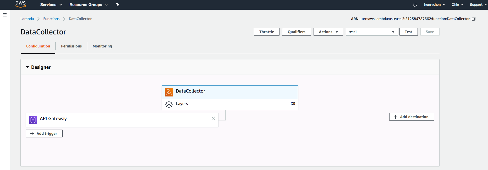
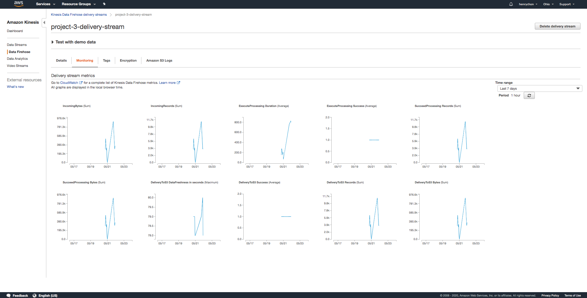

# Yahoo Finance Data Streaming with AWS Lambda

In this project, I am using the [yfinance](https://pypi.org/project/yfinance/) module get the pricing imformation of the following stock:

1. Facebook (FB)
2. Shopify (SHOP)
3. Beyond Meat (BYND)
4. Netflix (NFLX)
5. Pinterest (PINS)
6. Square (SQ)
7. The Trade Desk (TTD)
8. Okta (OKTA)
9. Snap (SNAP)
10. Datadog (DDOG)

The information I am interested in is one full trading day of stock high and low prices for each company listed above on Thursday, May 14th 2020, at an one minute interval.

I have created a AWS lambda function, which I call a [Data Collector](data_collector.py), to coleect the stock data. Then the data is transformed into a JSON format. Then each transformed record was put into a firehose delivery stream and was eventually streamed into a S3 bucket.

Lambda Function URL: https://bmjb7bg206.execute-api.us-east-2.amazonaws.com/default/DataCollector

I then set up a AWS Glue crawler so I can run AWS Athena [queries](query.sql) data with mt data. What I have generated is a [csv file](results.csv) that contains the highest hourly stock 'high' per company listed above.

Lastly, I have created a few visualizations on the data from the results.csv.

## [Analysis](Analysis.ipynb)

## Data Collector Lambda Configuration

## Kinesis Firehose Delivery Stream Monitoring

